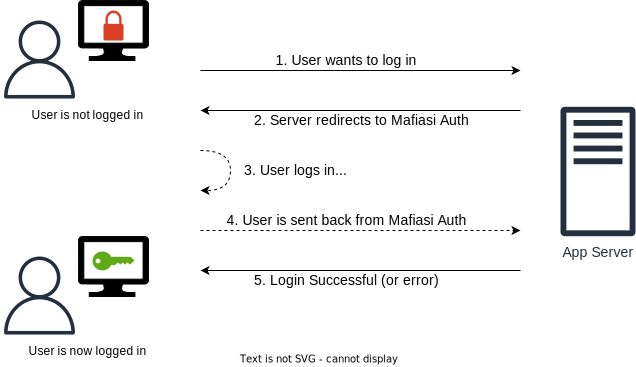
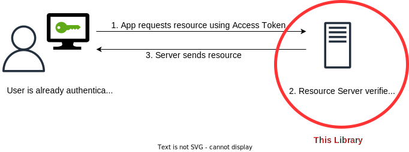

# Django Auth with Mafiasi

Django authentication library for working with Mafiasi.

## What it does

This library is intended for applications which are intended to be used in the context of [Mafiasi](https://mafiasi.de).
It particularly aims to take care of any authentication related functionality so that all Mafiasi services use the
same technology and conform to the same security requirements.

There are essentially two distinct feature-sets which this library provides:
1. **App Server Authentication**

   Authenticate users logging in to the current application.
   For this, the library provides utilities, database models and complete views for managing the login process as an app server.

   

2. **Resource Server Access Control**

   Validate and associate already authenticated users access tokens on this application (useful when this application is a backend API).
   For this, the library provides verification functions, database models and [djangorestframework authenticators](https://www.django-rest-framework.org/api-guide/authentication/).

   


## How to: *App Server Authentication*

1. First, you need to **add the library as dependency**. We don't publish it on pypi, so you will have to use a git dependency.
   See the documentation for [Poetry](https://python-poetry.org/docs/dependency-specification/#git-dependencies), [Pipenv](https://pipenv-fork.readthedocs.io/en/latest/basics.html#a-note-about-vcs-dependencies) or plain [requirements.txt](https://stackoverflow.com/questions/16584552/how-to-state-in-requirements-txt-a-direct-github-source) syntax.

   The relevant repository is the one
  at [github.com/fsinfuhh/django_auth_mafiasi](https://github.com/fsinfuhh/django_auth_mafiasi).

2. Next, **confiugre your Django application** ([docs](https://docs.djangoproject.com/en/dev/topics/settings/)).

   - If you use the *django-configurations* package, you can simply add the `django_auth_mafiasi.configuration.BaseAuthConfigurationMixin` to your configuration class:

     ```python
     # settings.py

     from django_auth_mafiasi.configuration import BaseAuthConfigurationMixin

     class MyConfig(BaseAuthConfigurationMixin, Configuration):
         INSTALLED_APPS = [
           …
         ] + BaseAuthConfigurationMixin.MAFIASI_AUTH_APPS
     ```

     A development configuration mixin exists as well. This is configured to allow every mafiasi user to log in and uses the *dev-client* for mafiasi-identity connections.

   - If you don't use *django-configurations* you will have to define the settings listed on the
     `BaseAuthConfigurationMixin` class
     from [configuration.py](https://git.mafiasi.de/mafiasi-ag/django_auth_mafiasi/src/branch/master/django_auth_mafiasi/configuration.py)
     in your settings.py file manually. Be sure to also add the defined apps to your *INSTALLED_APPS*:
     ```python
     # settings.py

     AUTH_GET_USER_FROM_ID_TOKEN_FUNCTION = "django_auth_mafiasi.auth.get_user_from_id_token"
     AUTH_GET_USER_FROM_ACCESS_TOKEN_FUNCTION = "django_auth_mafiasi.auth.get_user_from_access_token"
     AUTH_USER_MODEL = "django_auth_mafiasi.MafiasiAuthModelUser"

     AUTH_SERVER = "https://identity.mafiasi.de/auth/realms/mafiasi"
     AUTH_CLIENT_ID = os.environ.get("DJANGO_AUTH_CLIENT_ID")
     AUTH_CLIENT_SECRET = os.environ.get("DJANGO_AUTH_CLIENT_SECRET")
     AUTH_SCOPE = ["openid"]

     AUTH_STAFF_GROUPS = ["Server-AG"]
     AUTH_SUPERUSER_GROUPS = ["Server-AG"]

     REST_FRAMEWORK_REQUIRED_SCOPES = ["openid"]

     INSTALLED_APPS = [
         …,
         "django_auth_oidc",
         "django_auth_mafiasi",
     ]
     ```

3. Finally you need to **include routes** in your *urls.py* file:
   ```python
   # ursl.py
   from django.urls import include, path

   urlpatterns = [
     …,
     path('auth/', include('django_auth_mafiasi.urls')),
   ]
   ```


## How it works

As stated above, there are two distinct features which will be explained here.

### App Server Authentication

This is probably the most useful feature and explained in great detail [on the OAUTH website](https://www.oauth.com/)
which also provides a [playground](https://www.oauth.com/playground/oidc.html) for interactively trying it out.

In summary the following steps are performed:
1. User clicks *Login with Mafiasi* in the application
2. The application redirects to
   `https://<mafiasi-oidc>/auth?state=<something>&scope=<requested-scopes>&redirect_uri=<url-to-this-application>&client_id=<ths-application-id>`
3. The oidc issuer validates that the passed `redirect_uri` is allowed for the passed `client_id`, logs the user in
   (we don't really care how) and redirects back to `<redirect_uri>?state=<same-state>&session_state=<some-code>`
4. This application then validates that the passed `state` is the same and therefore associates step 1 with this response
   (prevents replay attacks), parses the `session_state` according to some openid spec, validates it (because it is signed),
   extracts some information from it (i.e. username) and logs the user in.

   At this point, the user gets authenticated via the standard django authentication framework and is accessible as normal.

### Resource Server Access Control

This feature is only relevant when programming an API which does not itself log a user in with the process described
above but when some other application logs the user in and then wants to use this API.

Normally when an application logs the user in, it does not only receive user information signed by the oidc issuer but
also an access token and request token signed by the same issuer. This access token can then be used to access resources
on this API.

These access tokens are [Json Web Tokens](https://jwt.io/) and can therefore simply be validated by the API.
If the validation succeeds, the request is an authenticated one.
